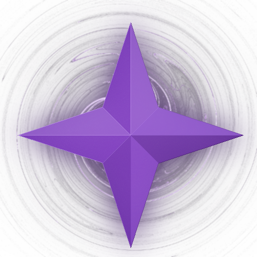

# Astra
#### The reflection solution for C++  

> [!IMPORTANT]  
> Looking for the old Astra library? [Click here](https://github.com/RobotLeopard86/Astra)

## About
Astra is a codegen-based reflection and serialization library for C++, based in part on and inspired by [`easy_reflection_cpp`](https://github.com/chocolacula/easy_reflection_cpp). Astra relies on C++20 features.

## Features
* Automatic reflection info generation via code generator
* Serialization/Deserialization to:
	* JSON
	* YAML
	* Binary
* Cross-platform
	* Generator runs on Windows, macOS, and Linux only
* Enum to/from string conversion
* STL container support

## Documentation
Documentation is built and deployed automatically to https://robotleopard86.github.io/Astra.  
If you want to build it yourself, instructions are located in the `docs` directory. See the [docs build instructions page](docs/README.md) for more information.

## Building
You will need:  
* Git
* Meson
* Ninja
* CMake  

All other dependencies will be downloaded at configure time.  

Configure the build directory with `meson setup build --native-file native.ini`, then run `meson compile -C build` to build the library. This can take a while, especially if building the generator, as it relies on a patched from-source build of LLVM. You do not have to use the native file (which sets the compiler to Clang and the linker to LLD), but it is recommended.

## Licensing
The Astra library and generator are licensed under the Apache License 2.0, which can be found in the root directory. All third-party licenses are present in the `licenses` directory, grouped by which component uses them.  

Transitive dependency libraries that are compiled into engine binaries and used at runtime will have their respective licenses located in the `transitive` directory within the `licenses` directory.  

All other transitive dependencies that are not involved in the build process or used at runtime will have their respective licenses found in the subproject directory of the owning project. This will not be downloaded until configure-time by Meson.

All Git patches and Meson build definitions located in `subprojects/packagefiles` are provided under the [MIT License](https://opensource.org/license/mit) instead, as this is the same license used by Meson wraps.
