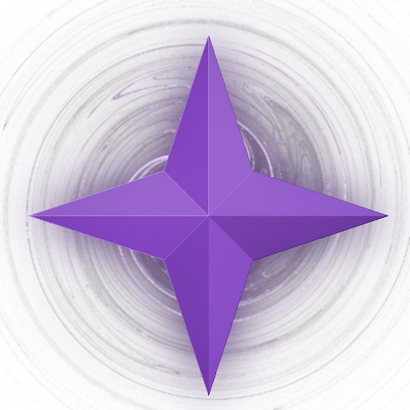

# Astra
#### The reflection solution for C++  

> [!IMPORTANT]  
> Looking for the old Silica library? [Click here](https://github.com/RobotLeopard86/Silica)

## About
Astra is a codegen-based reflection and serialization library for C++, based on [`easy_reflection_cpp`](https://github.com/chocolacula/easy_reflection_cpp). Astra requires C++20 or newer.

## Features
* Automatic reflection code generation
* Serialization/deserialization to:
	* JSON
	* YAML
	* Binary (encoded using [Jaguar](https://github.com/RobotLeopard86/Jaguar))
* Cross-platform
* Enum <-> string conversion
* Support for many STL types
* In-place serialized format conversion

## Documentation
Documentation is built and deployed automatically to https://robotleopard86.github.io/Astra.  
If you want to build it yourself, instructions are located in the `docs` directory. See the [docs build instructions page](docs/README.md) for more information.

## Building
You will need:  
* Git
* Meson
* Ninja
* CMake (optional)
* LLVM development libraries for your system

All other dependencies will be downloaded at configure time.  

> [!WARNING]  
> There is a **known issue on macOS** that its `llvm` Homebrew package does not symlink the necessary LLVM files into their proper locations, causing lookup to fail. To fix this, **run `ln -s /opt/homebrew/opt/llvm/bin/llvm-config /opt/homebrew/bin/llvm-config` to symlink the correct binary in your terminal before continuing.**

Configure the build directory with `meson setup build --native-file native.ini`, then run `meson compile -C build` to build the library. You do not have to use the native file (which sets the compiler to Clang and the linker to LLD), but it is recommended.

## Licensing
The Astra library and generator are licensed under the Apache License 2.0, which can be found in the root directory. All third-party licenses are present in the `licenses` directory, grouped by which component uses them.  

Any transitive dependencies that are not involved in the build process or used at runtime will have their respective licenses found in the subproject directory of the project that pulled them in. These files will not be downloaded until configure-time by Meson.

All Git patches and Meson build definitions located in `subprojects/packagefiles` are provided under the [MIT License](https://opensource.org/license/mit) instead, as this is the same license used by Meson wraps.

